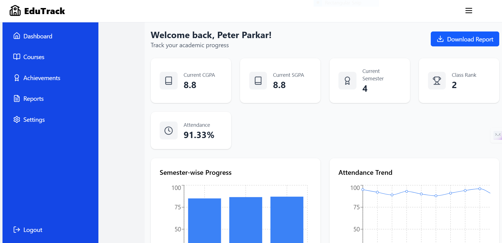
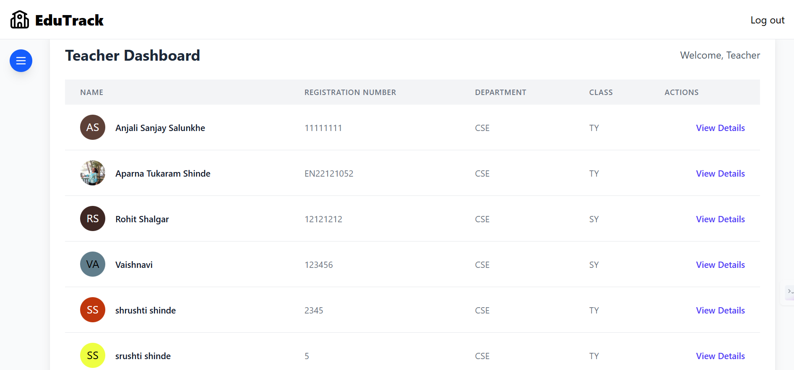
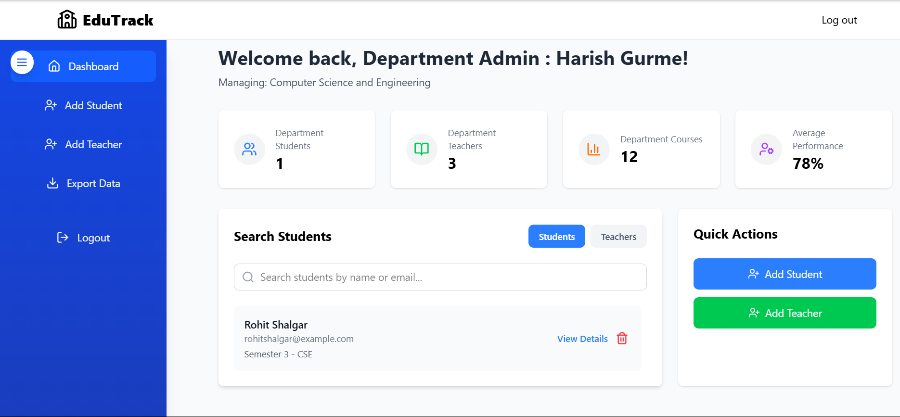
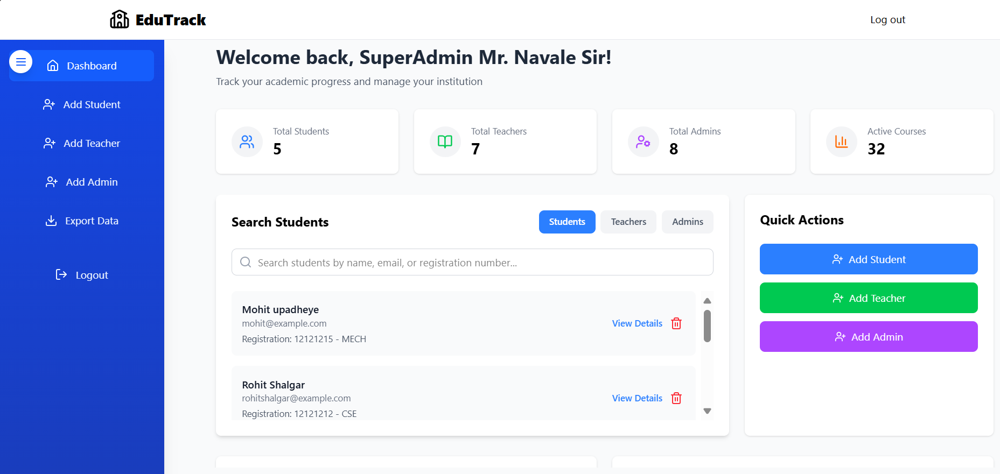
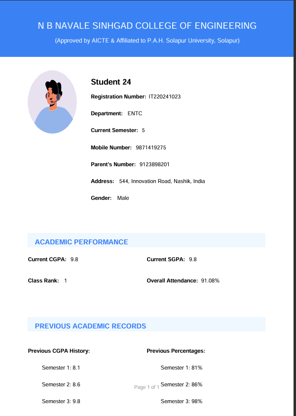
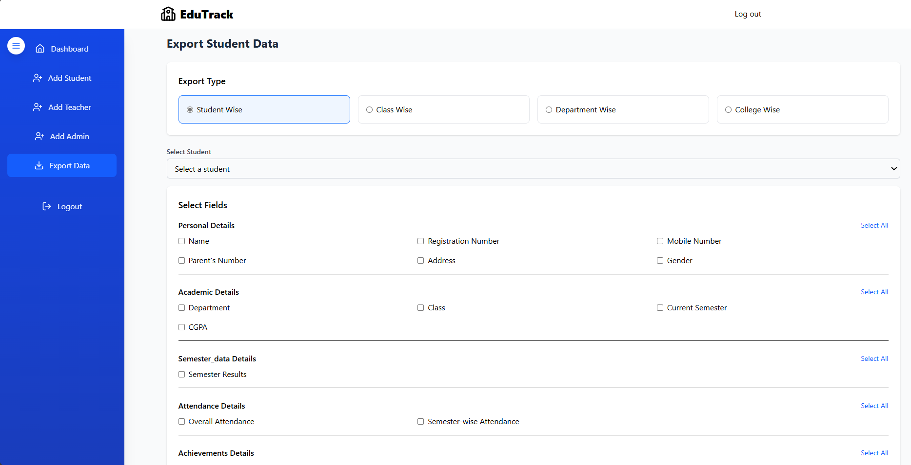

# EduTrack 🎓
**A Student Progress Tracking & Academic Insight Platform**

EduTrack is a full-stack web application designed to streamline the academic monitoring experience in educational institutions. It provides dedicated dashboards for students, teachers, and admins — enabling real-time performance tracking, attendance logging, and report generation with secure role-based access.

---

## 📌 Table of Contents
- [Features](#features)
- [Tech Stack](#tech-stack)
- [Installation](#installation)
- [Usage](#usage)
- [Folder Structure](#folder-structure)
- [Screenshots](#screenshots)
- [Author](#author)
- [Testing Instructions](#testing)

---

## ✨ Features

- 🔐 Role-Based Dashboards: Student, Teacher, Admin (including Super Admin)
- 📊 Real-Time Analytics: View performance, grades, and attendance progress
- 📝 Academic Management: Teachers can enter grades, mark attendance, and view student trends
- 🧾 Auto Report Generation: PDF reports generated per student
- 📤 Admin Features: Export data, manage users, and oversee academic records
- 📱 Fully Responsive: Mobile-friendly UI built with Tailwind CSS
- 🔒 JWT Authentication: Secure login and route protection
- 🔁 Developed using Agile SDLC methodology

---

## 🛠 Tech Stack

**Frontend**
- React.js
- Tailwind CSS
- Vite

**Backend**
- Node.js
- Express.js

**Database**
- MongoDB Atlas (NoSQL Cloud)

**Other**
- JWT Authentication
- Chart.js (Analytics)
- pdf-lib (PDF Report Generation)

---

## 🚀 Installation

```bash
# Clone the repository
git clone https://github.com/RohitShalgar4/EduTrack.git
cd EduTrack

# Install frontend
cd frontend
npm install
npm run dev

# In another terminal: install backend
cd ../backend
npm install
npm run dev
```

## 🎮 Usage 

- Sign up or log in as a student, teacher, or admin

- Students can view dashboards and download reports

- Teachers can enter grades, mark attendance, and give insights

- Admins can manage roles and export institutional data

- Super Admins have access to all modules and analytics

## ✅ Testing Instructions

You can use the following credentials to test EduTrack as a **Super Admin**.

### 👨‍💼 Super Admin

- **Email:** superadmin@example.com  
- **Password:** SuperAdmin@123

Once logged in, the Super Admin has complete control over the platform. You can:

- Manage all users and academic data
- View dashboards for department-level performance
- Export academic reports and institutional records
- **Add new users** including:
  - 🧑‍🎓 Students  
  - 👩‍🏫 Teachers  
  - 🧑‍💼 Department Admins  

Navigate to the **"Quick Actions"** section in the Super Admin dashboard to register users of other roles for testing or demonstration purposes.


## 📁 Folder Structure

```bash
EduTrack/
│
├── frontend/               # Frontend (React + Tailwind + Vite)
│   ├── components/
│   ├── pages/
│   ├── utils/
│   └── App.jsx
│
├── backend/               # Backend (Node + Express + MongoDB)
│   ├── controllers/
│   ├── models/
│   ├── routes/
│   └── app.js
│
└── README.md
```

## 📸 Screenshots

### 🧑‍🎓 Student Dashboard


### 👩‍🏫 Teacher Dashboard


### 👨‍💼🎓 Department Admin Panel


### 👨‍💼 Super Admin Panel


### 📄 Generated PDF Report


### 📤 Export Data Functionality



## 👨‍💻 Author

- Rohit Shalgar
- Email: rohitshalgar@example.com
- GitHub: @RohitShalgar4
